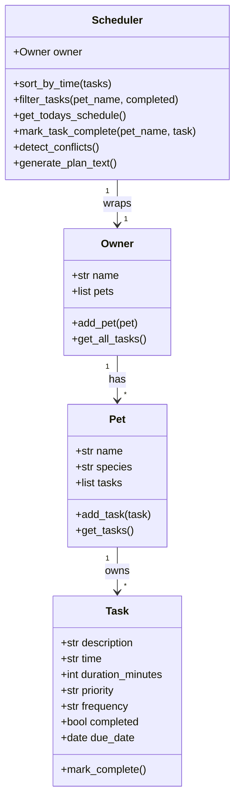

# PawPal+ (Module 2 Project)

You are building **PawPal+**, a Streamlit app that helps a pet owner plan care tasks for their pet.

## Scenario

A busy pet owner needs help staying consistent with pet care. They want an assistant that can:

- Track pet care tasks (walks, feeding, meds, enrichment, grooming, etc.)
- Consider constraints (time available, priority, owner preferences)
- Produce a daily plan and explain why it chose that plan

Your job is to design the system first (UML), then implement the logic in Python, then connect it to the Streamlit UI.

## What you will build

Your final app should:

- Let a user enter basic owner + pet info
- Let a user add/edit tasks (duration + priority at minimum)
- Generate a daily schedule/plan based on constraints and priorities
- Display the plan clearly (and ideally explain the reasoning)
- Include tests for the most important scheduling behaviors

## Getting started

### Setup

```bash
python -m venv .venv
source .venv/bin/activate  # Windows: .venv\Scripts\activate
pip install -r requirements.txt
```

### Suggested workflow

1. Read the scenario carefully and identify requirements and edge cases.
2. Draft a UML diagram (classes, attributes, methods, relationships).
3. Convert UML into Python class stubs (no logic yet).
4. Implement scheduling logic in small increments.
5. Add tests to verify key behaviors.
6. Connect your logic to the Streamlit UI in `app.py`.
7. Refine UML so it matches what you actually built.

---

## Features

### Smarter Scheduling

| Feature | Description |
|---------|-------------|
| **Sort by time** | Tasks are always displayed in chronological HH:MM order |
| **Filter by pet / status** | View pending or completed tasks for a specific pet |
| **Recurring tasks** | Daily and weekly tasks auto-schedule their next occurrence when marked complete |
| **Conflict warnings** | The scheduler flags when two tasks are booked at the exact same time |
| **AI explanation** | Claude (Haiku) reads the day's schedule and explains the ordering in plain English |

### Architecture

```
Owner
 └── [Pet]
      └── [Task]   ← dataclass: description, time, duration, priority, frequency, due_date

Scheduler(owner)   ← all algorithmic logic lives here
  .sort_by_time()
  .filter_tasks(pet_name, completed)
  .get_todays_schedule()
  .mark_task_complete(pet_name, task)   ← handles recurrence
  .detect_conflicts()
  .generate_plan_text()
```

Data flow is strictly top-down — no class reaches upward, making each layer independently testable.

### UML Class Diagram



---

## Testing PawPal+

```bash
python -m pytest
```

The test suite covers:
- Task completion (status mutation)
- Pet task management (add / count)
- Sorting correctness (chronological order)
- Filtering by pet name and completion status
- Daily and weekly recurrence (correct next due date)
- "Once" tasks do not recur
- Conflict detection (same time → warning; different times → silent)
- Edge cases (no pets, no tasks, empty schedule)

**Confidence level: ★★★★☆** — all happy paths and primary edge cases covered.

---

## Running the app

```bash
streamlit run app.py
```

To enable AI schedule explanations, set your Anthropic API key first:

```bash
export ANTHROPIC_API_KEY=sk-ant-...
streamlit run app.py
```
