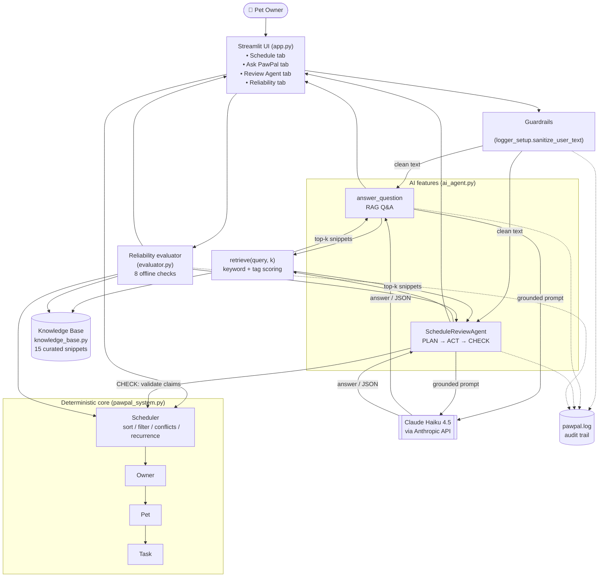

# PawPal+ Applied AI — System Architecture

The Mermaid source below is used to export `system_architecture.png`
(saved in this folder) via the Mermaid Live Editor.

```mermaid
flowchart TD
    User([🧑 Pet Owner])
    UI["Streamlit UI (app.py)
    • Schedule tab
    • Ask PawPal tab
    • Review Agent tab
    • Reliability tab"]

    Guard["Guardrails
    (logger_setup.sanitize_user_text)"]

    subgraph Core["Deterministic core (pawpal_system.py)"]
        Owner[Owner]
        Pet[Pet]
        Task[Task]
        Scheduler[Scheduler
        sort / filter / conflicts / recurrence]
        Owner --> Pet --> Task
        Scheduler --> Owner
    end

    subgraph AI["AI features (ai_agent.py)"]
        QA[answer_question
        RAG Q&A]
        Agent[ScheduleReviewAgent
        PLAN → ACT → CHECK]
    end

    KB[("Knowledge Base
    knowledge_base.py
    15 curated snippets")]
    Retriever["retrieve(query, k)
    keyword + tag scoring"]

    Claude[["Claude Haiku 4.5
    via Anthropic API"]]

    Eval["Reliability evaluator
    (evaluator.py)
    8 offline checks"]

    Log[("pawpal.log
    audit trail")]

    User --> UI
    UI --> Guard
    Guard -->|clean text| QA
    Guard -->|clean text| Agent
    UI --> Scheduler

    QA --> Retriever
    Agent --> Retriever
    Retriever --> KB
    Retriever -->|top-k snippets| QA
    Retriever -->|top-k snippets| Agent

    QA -->|grounded prompt| Claude
    Agent -->|grounded prompt| Claude
    Claude -->|answer / JSON| QA
    Claude -->|answer / JSON| Agent

    Agent -->|CHECK: validate claims| Scheduler

    QA --> UI
    Agent --> UI

    UI --> Eval
    Eval --> KB
    Eval --> Scheduler
    Eval --> Agent
    Eval --> UI

    Guard -.-> Log
    QA -.-> Log
    Agent -.-> Log
    Eval -.-> Log
```
